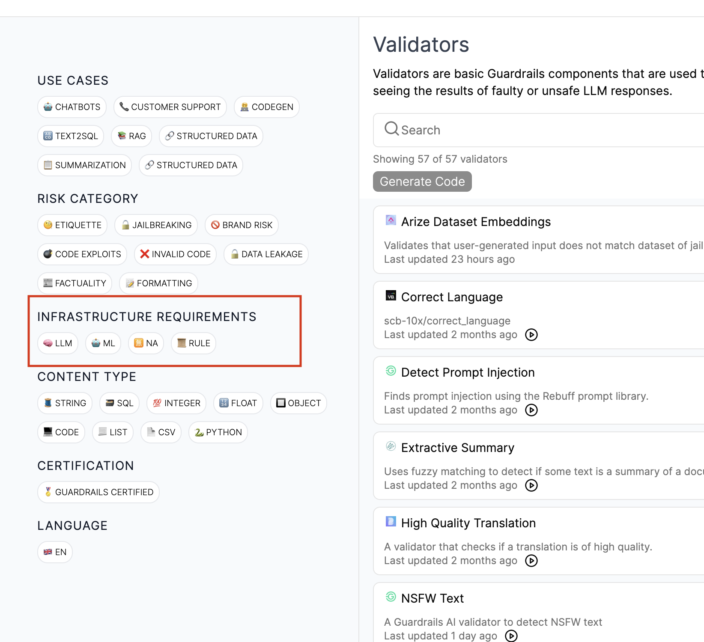

# ML Based Validators

Although simple validation can often be handled with rule-based approaches, more complex scenarios require machine learning models for effective validation. 

ML based validators are able to handle more complex scenarios, providing some level of 'intelligence' to the validation method that is used.

<!-- WARNING: THIS FILE WAS AUTOGENERATED! DO NOT EDIT! Instead, edit the notebook w/the location & name as this file. -->

In the Guardrails Hub, we provide an easy way to filter and search for different validator types!



While different validators may be rules-based or machine learning based, it is still just as easy to implement both in your codebase.


```python
from guardrails import Guard
```

```bash
guardrails hub install hub://guardrails/competitor_check
guardrails hub install hub://guardrails/regex_match
```

### Rules-based validators


```python
from guardrails.hub import RegexMatch

guard = Guard().use(RegexMatch, regex=r"^[a-zA-Z0-9_]+$")

result = guard(
    model="gpt-3.5-turbo",
    messages=[
        {"role": "system", "content": "You are a helpful assistant."},
        {"role": "user", "content": "Tell me about the Apple Iphone."},
    ],
    max_tokens=1024,
    temperature=0,
)
print(result)
```

### ML Based Validator


```python
from guardrails.hub import CompetitorCheck

guard = Guard().use(CompetitorCheck, ["Apple"])

result = guard(
    model="gpt-3.5-turbo",
    messages=[
        {"role": "system", "content": "You are a helpful assistant."},
        {"role": "user", "content": "Tell me about the Apple Iphone."},
    ],
    max_tokens=1024,
    temperature=0,
)
print(result)
```
